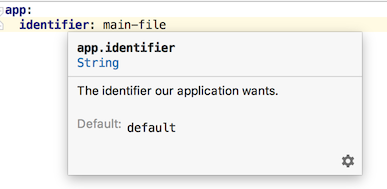

This Spring Boot code demonstrates several ways of using a [type-safe configuration class](https://docs.spring.io/spring-boot/docs/current/reference/html/boot-features-external-config.html#boot-features-external-config-typesafe-configuration-properties)
during unit testing with properties set by various means.

The application itself does nothing useful. If you run it, the `LogIdentifierRunner` will simply
log the value of `app.identifier` that was loaded into the properties bean `AppProperties` that
was autowired into the service bean `UsesAppPropertiesService`. 

This in itself demonstrates a feature of Spring Boot where it can [externalize configuration](https://docs.spring.io/spring-boot/docs/current/reference/html/boot-features-external-config.html)
from several places including an `application.yml` (or `application.properties`) located in the 
application's class path. In Maven/Gradle terms, that's simply the file 
`src/main/resources/application.yml` since the build will carry that over to the application's
build artifact.

To give some background, the focal point of this repository is a type-safe properties class,
`AppProperties`, which contains:

```java
@ConfigurationProperties("app")
@Component
@Data
public class AppProperties {

  /**
   * The identifier our application wants.
   */
  String identifier = "default";
}
```

There's a lot going on in this one little, single-field class:
- `@ConfigurationProperties("app")` marks this as a type-safe configuration properties class that
  will be bound to properties with the `app` prefix
- `@Component` marks this class to be picked up by [component scanning](https://docs.spring.io/spring/docs/current/spring-framework-reference/core.html#beans-classpath-scanning)
  and registered into the Spring application context
- `@Data` is a [Lombok](https://projectlombok.org/) annotation that gets processed during compilation
  to make the data fields private and inject getter/setters. It also injects [a few other things](https://projectlombok.org/features/Data)
- The field `identifier` is what our application wants to access. It will become bound to a 
  sub-property named for the field, `identifier`, and that binding will ensure it is a valid `String`.
  It is declared with a default literal value, `"default"`. That default value, along with the
  field's type and name, get picked up by [configuration processing](https://docs.spring.io/spring-boot/docs/current/reference/html/configuration-metadata.html)
  and displayed by your IDE, etc.
- The field description in the javadoc `/** ... */` also gets picked up by configuration processing 
  and is displayed in this IntelliJ quick docs tooltip:
  
  

The bulk of this repository is actually the unit tests located in `src/main/test`. The following
sections describe each strategy used to populate `AppProperties` during a unit test.

## Full context

```java
@RunWith(SpringRunner.class)
@SpringBootTest
```

This is the easiest since a `@SpringBootTest` effectively initiates a full application context
load along with all the externalized configuration loading and property binding.

The property value gets picked up from the `application.yml` in the class path, which originates
from `src/main/resources`.

## Full context using inline property values

```java
@RunWith(SpringRunner.class)
@SpringBootTest(
    properties = "app.identifier=inline"
)
```

This one overrides the value loaded from the classpath's `application.yml` with an inline property
value.

## Minimal context using defaults from property class

```java
@RunWith(SpringRunner.class)
@ContextConfiguration(classes = {
    UsesAppPropertiesService.class
})
@EnableConfigurationProperties(AppProperties.class)
```

As discused [in the Spring Boot docs](https://docs.spring.io/spring-boot/docs/current/reference/html/boot-features-testing.html#boot-features-testing-spring-boot-applications-testing-autoconfigured-tests),
sometimes you want and sometimes should test with a purposeful slice of your application's context.
Unfortunately it takes a little more work to fine tune our test's context:

- The `@ContextConfiguration` brings in our service to be "tested"
- The `@EnableConfigurationProperties` activates the configuration binding of our specific class
  and also registers it into the application context.
  In this case, I could have just added `AppProperties` to the context configuration's `classes`;
  however, I find `@EnableConfigurationProperties` more explicit and translates better to the other
  options, below.

## Minimal context using main `application.yml`

```java
@RunWith(SpringRunner.class)
@ContextConfiguration(classes = {
    UsesAppPropertiesService.class
}, initializers = {
    ConfigFileApplicationContextInitializer.class
})
@EnableConfigurationProperties(AppProperties.class)
```

This one better approximates (and verifies) what the final application will do by loading the
externalized configuration from the main `application.yml`. The addition of the
[`ConfigFileApplicationContextInitializer`](https://docs.spring.io/spring-boot/docs/current/reference/html/boot-features-testing.html#boot-features-configfileapplicationcontextinitializer-test-utility) 
in the `@ContextConfiguration` is what activated that behavior.

## Minimal context using test specific properties file

```java
@RunWith(SpringRunner.class)
@ContextConfiguration(classes = {
    UsesAppPropertiesService.class
})
@EnableConfigurationProperties(AppProperties.class)
@TestPropertySource
```

This one uses a feature provided by Spring Core's test facilities, which is the
[`@TestPropertySource`](https://docs.spring.io/spring/docs/current/spring-framework-reference/testing.html#spring-testing-annotation-testpropertysource).
This default use of the annotation is especially useful since you can alter the properties used for
each test suite. It looks for a `.properties` file named for the test class and the package/directory
containing it. In this repository, that file is `me/itzg/trytestpropertiesloading/MinimalContextPropSourceTest.properties`,
which is located in `src/test/resources`.

## Minimal context using inline property values 

```java
@RunWith(SpringRunner.class)
@ContextConfiguration(classes = {
    UsesAppPropertiesService.class
})
@EnableConfigurationProperties(AppProperties.class)
@TestPropertySource(properties = "app.identifier=inline")
```

This one is a slight variation on the previous, replacing the properties file with the
properties set inline using the `properties` of `@TestPropertySource`. Note how this approach is
consistent with the `properties` of `@SpringBootTest` used above.